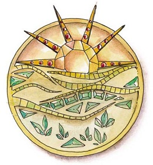

# Downtime in Galmoren

## Shopping
*Niko will utilize Vergadain's smile to negotiate prices whenever possible.*

- [ ] Find Familiar components
- [ ] Sending scroll.
- [ ] Sealing wax
- [ ] Hire a jeweler to make necklace with the symbol below. *Inscription on back:* "Dark clouds *do* fear the Sun. *Stay bright*."

## Library / Research
- [ ] **The Grey Waste:** Specifically, do the documented symptoms match my memory of my father's symptoms (*subtext:* is it possible that I lied to)?
- [ ] **Ebal Magisterium**: Anything.
- [ ] **Planar Travel:** Specifically, what resides on the other planes (any mention of alternative realities or altering the past would be of particular interest)?

## Communication
- [ ] Package the necklace and seal using the sealing wax with Niko's signet ring. Ask Erwin to deliver the package to Henrietta. Show him mentally how to reach Aramoor, how to get to Henrietta's window unnoticed. Show him what she looks like; tell him she might look older now; let him feel my fondness for her. Tell him to stay concealed; no one but Henrietta is to discover him or the necklace. Return to me after.
- [ ] Using Sending scroll (if obtained), contact Grahm Stavenger, the blacksmith my father favored and with whom we frequently lent our hands. Grahm is stoic, gruff, and honest. In Niko's experience Grahm has never behaved subservient or deferential. Niko asks Grahm about the well-being of Aramoor / Hanrindel. 

## If Princess Muriel Durimere asks us to travel to Maneas
- Who will be in attendence at this council? Which domains will be represented?
- What is expected of us once we are there?
    - If little is expected (i.e., it will be easy to keep a low profile) Niko will not voice dissent.
    - Otherwise, Niko will question what reason the party has to travel across the world? This is not our buisiness. We are not merchants or politicians. And there is much yet to be discovered in Dothombar. 
    - In the end, Niko will got along with the party either way.
- Niko will then seek means (better than Disguise Self in terms of duration and magical energy cost) to disguise / conceal himself while in Maneas.

## Finances 
*Whether Niko does this is dependent on how much currency Niko has left over.*
- Niko tries to find away to consolidate / compress his newly found wealth. Are there banks? 
- If Niko doesn't find a bank or other convenient means to store wealth, he'll track down Beorn and offer to make an investment in his mining company.
