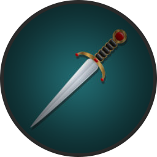

### Description:
The hilt of this dagger is gold with a large inset ruby -- looking closely at the gemstone reveals a laughing dwarf's face carved below.

### Out of Combat:
If you are attuned to this dagger, you have advantage on Persuasion checks made to turn a monetary profit.

### Combat:
When you roll a 1 on a damage die when attacking with this dagger, you may reroll that die.  You must keep the result.