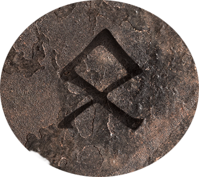

* Master Blacksmith
* Was a mortal man
* Before the scattering
* Apprentice to Dorgoon(?), "chosen of Moradin" (probably not mortal)
* Was chief smith at Gilrun (now called Cold Forge)

- Gimil's items are rare

- Dorgoon kept his items locked up in his vault
    - Vault remains untouched
    - It is in Cold Forge
- Once upon a time any Dwarf who held power had an item of Dorgoons (before he was chosen)
- Forge was split durring the scattering
- Most dwarves think its bad luck to visit / live in a place for the forge went cold
- Intrepid adventurers rarely return
- Tales of Orcs inhabitting area
- Over 300 years since someone has come back
    - That person was Orron, the sniffer!

### His Maker's Mark:
