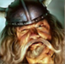

#### Place of Origin: 
Galmoren
#### First Encounter Location: 
Drunken Pilgrim, Galmoren
#### Last Known Location: 
Drunken Pilgrim, Galmoren

#### Notes:
Married to Tarly.

* Proprietor of Drunken Pilgram
* Sells "Baby's Beard"
    * A powerful alcoholic beverage made with strange red syrup
* Bickers with his wife, Tarly
* Niko has hidden gold in Grandi's flower garden
- Someone carved the word "Traitor" into the door of the drunken pilgrim.
    * Triss mended it.
* Currently in hidding
    * Thugs have been harrassing and beating him (probably for helping outsiders)

