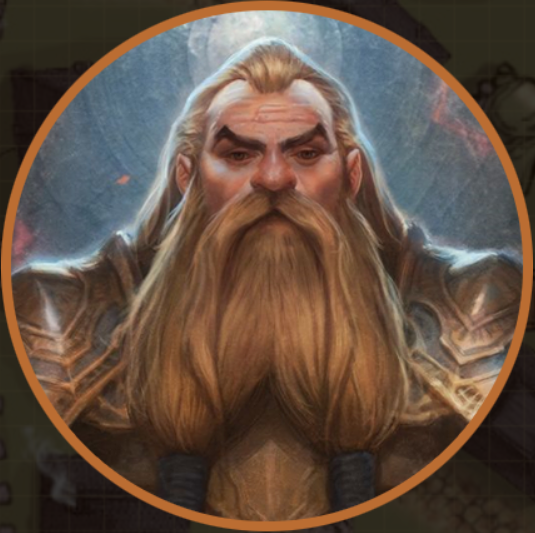

# Gilthur Fireforge 

**Race**: Mountain Dwarf  
**Class**: Paladin  
**Factions**: Fellowship of the Forge, Second Sons of Moradin  

**Notes**:
- Interested in Gilrun (coldforge)
- Interested in outsiders, as "times are changing in Dorthombar", and he doesn't know any outsiders.
- His shields has the same symbol as our map, an Anvil on a copper inlay in a bed of (?)flames.
    - Symbol of the Second Sons of Moradin
   